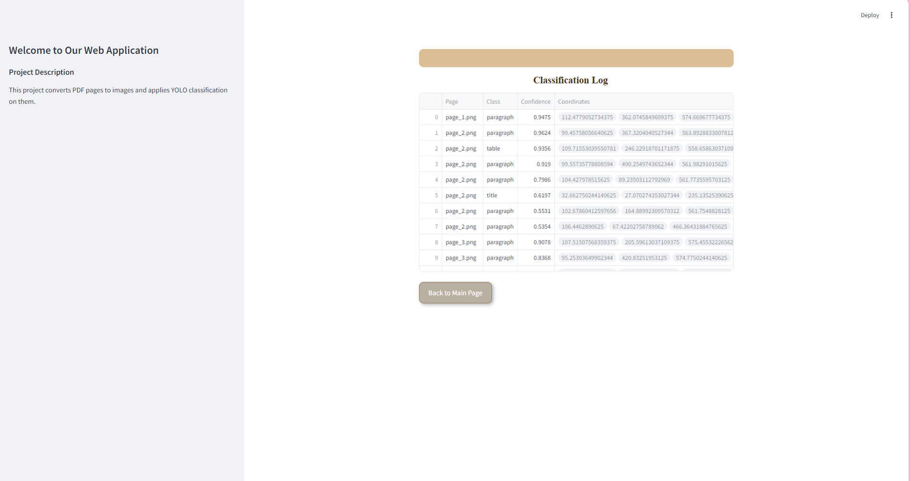

# PDF-to-Image Conversion & YOLOv5 Classification Web Application

## Fonctionnalités
Chargement et conversion de PDF en images :

L'utilisateur peut télécharger un fichier PDF. Chaque page sera convertie en une image au format PNG.
1. Classification avec YOLOv5 :
Les images sont traitées par un modèle YOLOv5 pour identifier et annoter les objets détectés avec des boîtes de délimitation et des labels de classification. Cette partie utilise YOLOv5 pour entraîner un modèle de détection et de classification d'objets à partir d'une image, et pour effectuer des inférences sur un ensemble d'images. Les images seront classées en 9 catégories :'caption', 'equation', 'figure', 'footnote', 'list', 'note', 'paragraph', 'table', et 'title'.
![Description de l'image]


2. Visualisation des images avec annotations de classification.
Affichage d'un journal de classification, incluant les classes, la confiance de prédiction, et les coordonnées des boîtes de délimitation.
Navigation facile :

3. Interface utilisateur intuitive avec des boutons pour revenir aux sections précédentes.
Carrousel d’images pour naviguer entre les pages annotées du PDF.

# Mon Projet

## Étape 1 : Image 1


## Étape 2 : Image 2


## Étape 3 : Image 3


## Étape 4 : Image 4


## Prérequis

Avant de commencer, assurez-vous d'avoir installé les éléments suivants :

- **Python** : Version 3.12.4 ou ultérieure
- **Ultralytics YOLO** : [GitHub Repository](https://github.com/ultralytics/yolov5)
- **OpenCV**
- **NumPy**

Vous pouvez installer les packages requis avec la commande suivante :

```bash
pip install ultralytics opencv-python numpy
```
## Création, Activation de l'Environnement Virtuel et Installation de YOLOv5

1.Créer un environnement virtuel :

```bash
python -m venv myenv
```
```bash
myenv\Scripts\activate
```

2.Cloner le dépôt YOLOv5 :
```bash
git clone https://github.com/ultralytics/yolov5.git
```
3.Installer les dépendances :
```bash
pip install -r requirements.txt
```

le lien vers la dataset : https://universe.roboflow.com/shuyi/document_category

Le modèle entraîné est trained-model2.pt
